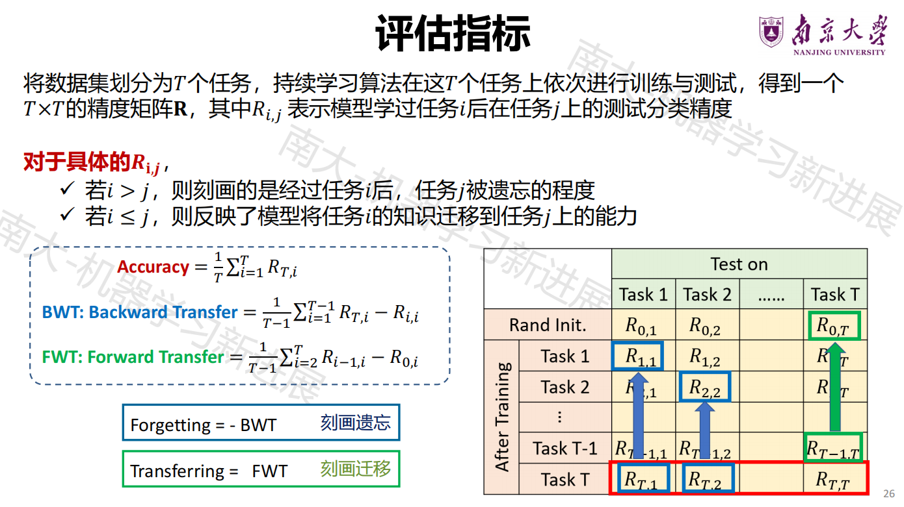
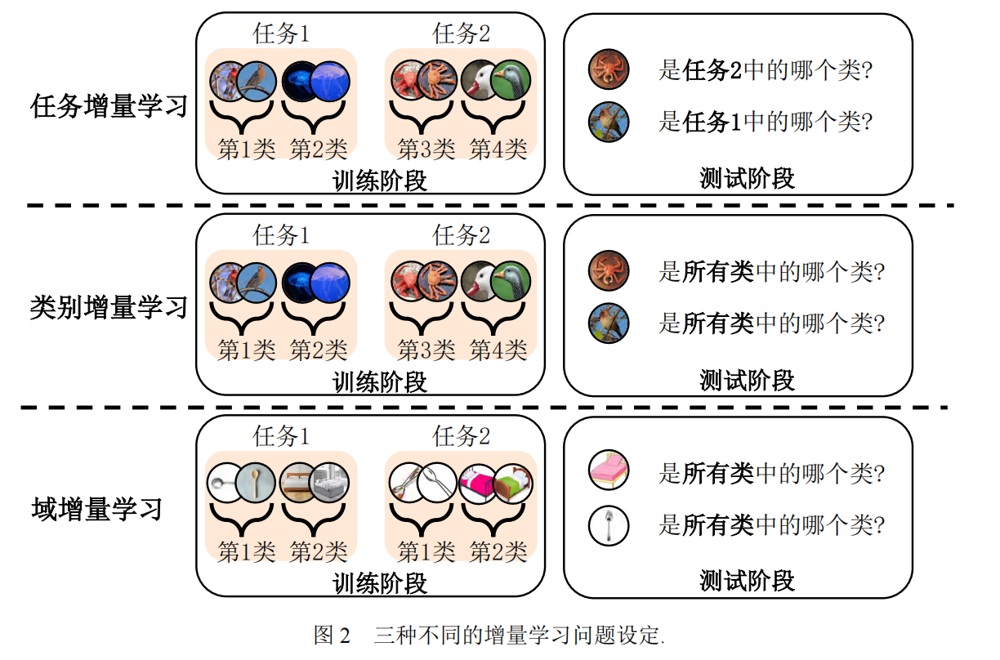
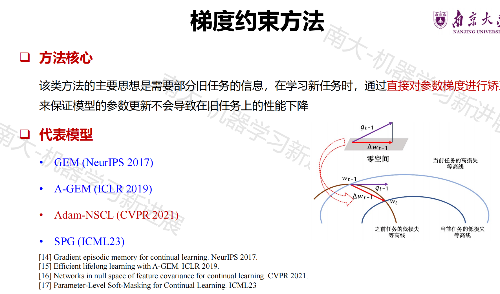
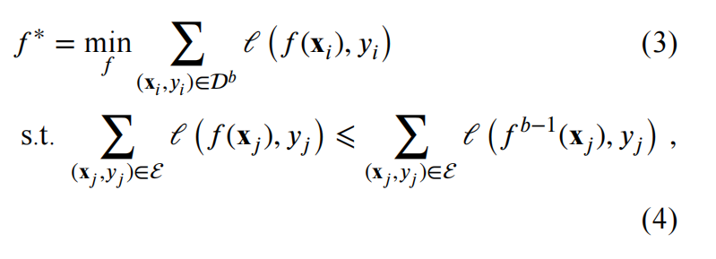
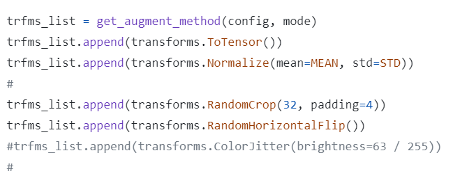
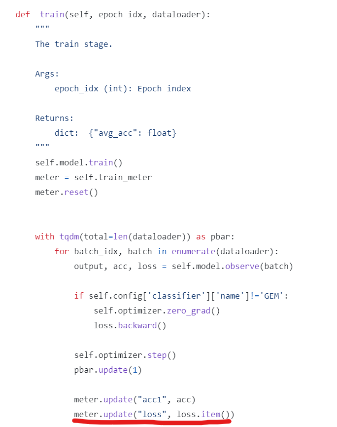
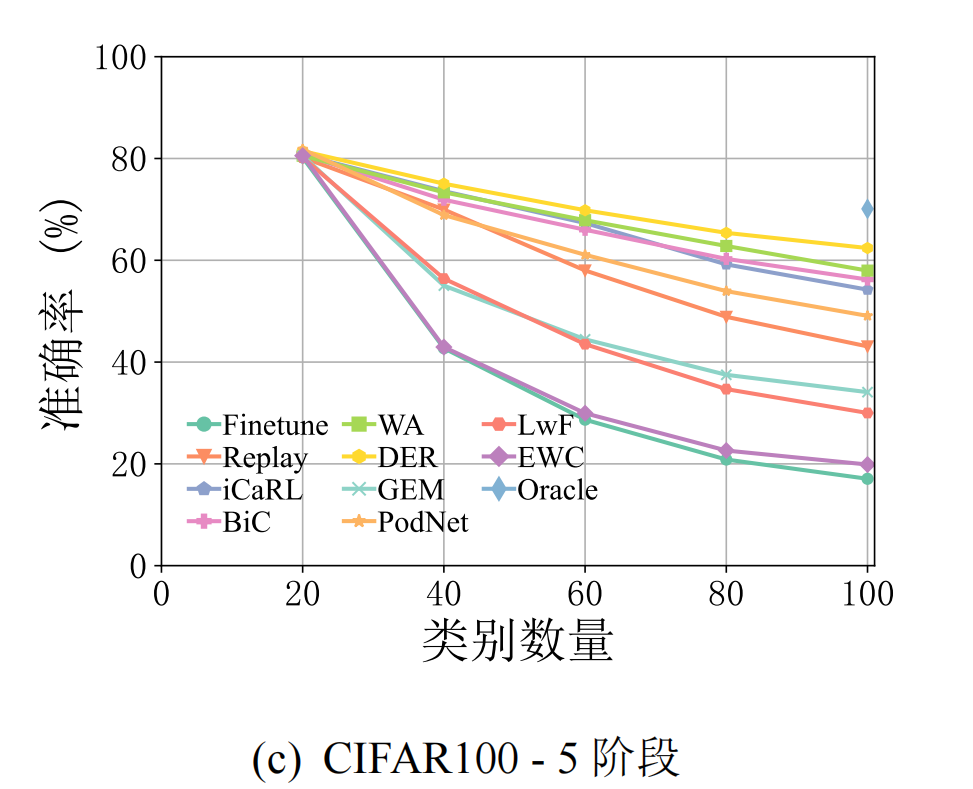
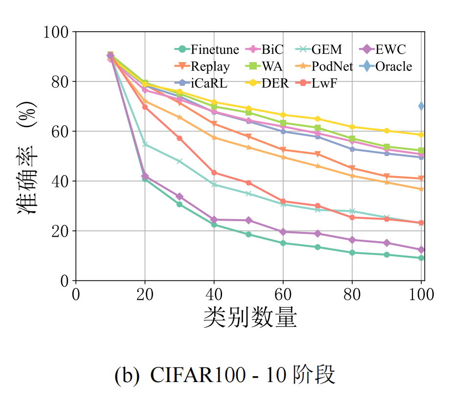

## 实验报告


代码仓库：https://github.com/zldscr0/GEM


[TOC]


### 一.GEM简介

#### 持续学习

任务定义：研究从持续到来的不同任务中学习并积累知识，逐渐扩充模型，也称为增量学习（*incremental learning*）、终生学习（*lifelong learning*）


#### 持续学习当中的一些概念

##### 灾难性遗忘

面对不断到来的新数据, 直接使用他们更新模型会引发**灾难性遗忘**(*catastrophic forgetting*) ——模型在学习新数据的同时会遗忘以往学得旧数据的模式，失去对旧数据的判别能力，从而导致模型分类性能的急剧下降。

因此，如何在模型持续学习新数据的同时抵抗对旧数据的灾难性遗忘便成为增量学习问题的研究重点。

##### 范例集

按照类别增量学习过程的定义，模型在学习第 𝑏 个任务时仅能获取当前的训练集$D^b$。仅使用$D^b$更新模型很容易遭受灾难性遗忘。因此，当前类别增量学习的主流算法提出保存<u>一个额外的范例集合</u> (*exemplar/example set*)， 记作$\epsilon$， 用于为每个见过的类别保存一定数目的代表性样本。保存的样本可以在学习新类的过程中辅助模型抵抗灾难性遗忘。

##### 评估指标




框架代码提供的评估指标主要是$R_{i，j}$，其中$i>=j$，

以及上图中的Accuracy，即模型的平均准确率。

##### 持续学习场景



###### 任务增量学习

不同时刻到来的数据分属于不同的任务，在一个时间段内我们可以获得当前任务的全部数据，并且假设测试推理阶段，**任务的编号（task-ID）是可知**的因为测试阶段任务编号可知，所以训练阶段不同任务的输出相互独立，即<u>最终学到的模型是多头的</u>（multi-head），为每个任务提供单独的输出层因此，针对任务增量场景，模型在训练和测试阶段均会提供数据对应的任务编号。

###### 类别增量学习

不同时刻到来的数据属于同一类型任务的不同类别，随着训练的进行逐步增加输出类别，即**类别空间是逐渐扩充的**，不同于任务增量学习场景，类别增量学习场景在测试阶段不知道任务的编号（训练阶段知道任务编号），比任务增量场景更具挑战性。

###### 域增量学习

不同时刻到来的数据属于不同任务，但是任务之间的类别空间是相同的，只是数据的分布（域）发生了变化，前后两个任务的数据不再满足独立同分布假设。

#### GEM



除了利用旧类数据可以进行数据重放, 通过复习旧类知识抵抗灾难性遗忘之外，还有其他的思路利用旧类数据集，梯度约束的方法就是利用旧类数据集来对参数梯度进行约束矫正，从而约束模型的更新过程，以抵抗灾难性遗忘。这类方法中GEM是一项具有代表性的工作 , GEM 希望找到最优的模型𝑓 ∗ 满足:



其中, $𝑓_{𝑏−1}$​ 代表上一阶段训练结束时的增量模型.公式3表明, GEM 的优化目标是找到能够在新任务上最小化分类损失的模型 𝑓, 同时要保证其在范例集上的分类损失不大于上一阶段模型在范例集上的损失. 由于范例集中的样本均来自旧类, 这一约束一定程度上维持了模型在旧类上的性能. 为了考察模型在样本上的损失, **GEM 计算模型在范例集上的梯度 𝑔ℰ 和在当前任务样本集上的梯度 𝑔. 如果二者夹角大于 90°, 则将当前任务的梯度投影到距离其夹角最小的范例集的梯度方向上, 以满足上述约束**. 这个问题被进一步转化为二次规划问题进行求解. GEM 的想法非常直观: 只要能够保证模型在范例集上的损失不增大, 那么就认为模型在旧类上的性能就不会下降。


---

### 二. LibContinual框架介绍及主要修改

A framework of Continual Learning

为了将GEM这一算法集成到框架中，对框架的部分模块进行了修改，主要修改如下。

#### 主要模块修改

##### 1.data模块

> `./core/data`负责dataset的读取逻辑

这一部分加入了两个transform，也是性能提升的关键处，主要改动是在`./core/data/dataloader.py`中增加了两行数据变换的代码：

#分隔的地方是新增的代码，主要加入了一个水平变换和随机裁剪填充，不过这个部分有个疑惑点，这两行代码直接将官方代码（也有可能是PyCIL）的数据变换方式抄了下来，当时没注意到CIFAR100的图像本身就是32*32的，随机裁剪填充的尺寸也是32，padding还设为了4，这样变换就是先对图像的四周添加一个大小为 4 像素的填充，让图像的最终大小将变为40，然后再裁出 32x32 的区域，本以为这样的变换没什么用，但是我把这行注释了之后，发现准确率会下降3个百分点左右，所以最终结果还是用了这一变换。



##### 2.backbone模块

> `./core/model/backbone`'负责backbone模型文件的定义(不包含fc)

这一部分加入了在Cifar Dataset上优化的ResNet（https://arxiv.org/abs/1512.03385.pdf）结构定义，加入的文件名叫`cifar_resnet.py`，照搬了PyCIL库中的代码。

同时为了引入resnet32，在`./core/model/backbone/__init__.py`下加入了一行

```python
from .cifar_resnet import resnet32
```

##### 3.buffer模块

> `./core/model/buffer` 负责训练过程中buffer的管理以及更新。 目前只实现了LinearBuffer, 在每个任务开始前会把buffer样本与新样本拼接在一起，buffer的更新策略，目前只支持了随机更新。

这一部分没做修改，没有添加其他的buffer策略，不过GEM的实现中有用一个memory数组存储范例集（在GEM.py中定义），这个数组跟buffer很像，但是只是用它来计算梯度，并没有把它加入到新任务的训练集当中。由于时间关系，没有将memory的实现修改为buffer的实现，gem的配置文件中buffer仍然选用了LinearBuffer，但是把它的存储量（buffer_size）设置为0，避免了数据重放。

`config/gem.yaml`

```yaml
buffer:
  name: LinearBuffer
  kwargs:
    buffer_size: 0
    batch_size: 32
    strategy: random     # random, equal_random, reservoir, herding
```

##### 4.logger模块

> `./core/utils/logger.py` 负责训练过程中的日志打印。 此处选择直接hack 系统输出，因此大家在训练过程中不需要显示的调用logger.info等接口， 直接正常的print想要的信息，logger模块会自动的保存在日志文件中.

没有做任何修改。

##### 5.trainer模块

> `./core/trainer.py` 负责整个实验的流程控制。 大家在复现各自方法的时候，如果流程上有暂时支持不了的，可以直接修改trainer.py来满足，并且可以反馈给我，后续我会对流程做进一步的完善.

修改一：`core/trainer`里的_train函数没有回传loss值：

修改二：GEM的oberve中已经进行了反向传播，计算出梯度，并通过一定的约束策略矫正了梯度，执行完之后不需要再进行一次梯度清零和方向传播，直接更新参数就行，因此在_train函数里加入了一个条件判断语句，如果是GEM算法的话就跳过这两条语句。

```python
self.optimizer.zero_grad()
loss.backward()
```



##### 6.config模块

> './config/', 负责整个训练过程的参数配置。 

除了之前提到的buffer_size设为0之外，主要根据实验设置和classifier的特定参数对配置文件进行了修改，具体的参数设置见后续的实验部分。

backbone部分如果是resnet18或resnet34（定义在`core/model/backbone/resnet.py`中），kwargs需要加入num_classes参数。

```
num_classes: 100
    args: 
      dataset: cifar100
```

如果是resnet32就不需要添加别的东西，但是classifier里的feat_dim需要由512变为64。

`config/gem.yaml`

```yaml
includes:
  - headers/data.yaml
  - headers/device.yaml
  - headers/model.yaml
  - headers/optimizer.yaml
  - backbones/resnet12.yaml

data_root: /bzx/data/cifar100
image_size: 32
  
save_path: ./

# data
init_cls_num: 10
inc_cls_num: 10
task_num: 10


epoch: 150
device_ids: 0
n_gpu: 1
val_per_epoch: 5


batch_size: 128


optimizer:
  name: SGD
  kwargs:
    lr: 0.1
    momentum: 0.9
    weight_decay: 2e-4


lr_scheduler:
  name: MultiStepLR
  kwargs:
    gamma: 0.1
    milestones: [80, 120]

backbone:
  name: resnet32
  kwargs:

buffer:
  name: LinearBuffer
  kwargs:
    buffer_size: 0
    batch_size: 32
    strategy: random     # random, equal_random, reservoir, herding

classifier:
  name: GEM
  kwargs:
    num_class: 100
    feat_dim: 64
    #feat_dim: 512
    #n_hiddens: 100
    #n_layers: 2
    n_memories: 2000
    #n_outputs: 100
    n_task: 10
    memory_strength: 0
```


---

### 三. 核心函数

##### 1.`model/replay/gem.py/`中的observe函数

见下面的注释，正式代码中未整理过多注释，可能有点乱。

```python
def observe(self, data):
        # 将数据从data字典中提取，然后将图像数据 (x) 和标签数据 (y) 移动到指定的设备上(GPU)
        x, y = data['image'], data['label']
        x = x.to(self.device)
        y = y.to(self.device)
        
        # self.t是当前的任务编号，如果旧任务编号与新任务不同，就将新任务编号加入到这一数组中，从而记录当前已经训练的任务。self.observed_tasks这一数组中，从而记录当前已经训练的任务。
        if self.t != self.old_task:
            self.observed_tasks.append(self.t)
            self.old_task = self.t

        
        '''
        self.memory_data用来存储范例集，self.memory_labs用来存储范例集标签
        它们的定义如下：
        self.memory_data = torch.FloatTensor(n_tasks, self.n_memories, d,h,w)
        self.memory_labs = torch.LongTensor(n_tasks, self.n_memories)
      
        self.memory_data的更新策略是ring buffer，这意味着新的数据将会覆盖旧的数据，形成一个环形缓冲区，每一个task中后出现的数据会放在buffer里。
        这一段代码就是在实现一个ring buffer，并把这一批次的数据存到对应任务的buffer里。
        
        '''
        bsz = y.size(0)
        endcnt = min(self.mem_cnt + bsz, self.n_memories)
        effbsz = endcnt - self.mem_cnt
       
        self.memory_data[self.t, self.mem_cnt: endcnt].copy_(
            x[: effbsz])
        if bsz == 1:
            self.memory_labs[self.t, self.mem_cnt] = y.data[0]
        else:
            self.memory_labs[self.t, self.mem_cnt: endcnt].copy_(
                y[: effbsz])
        self.mem_cnt += effbsz
        if self.mem_cnt == self.n_memories:
            self.mem_cnt = 0

        
        # compute gradient on previous tasks
        '''
        这段代码就是在计算当前模型在之前的任务（范例集）上的损失，并计算梯度，最后把梯度存在self.grads中
        
        这篇论文的原始代码计算的offset1, offset2的原因是它在做任务增量学习，于是对先前任务做前向传播后的预测类别是对应任务的类别，但是本篇复现是在做类增量学习，因此预测类别应该是当前任务以及所有先前任务类别的并集，所以compute_offsets这一函数计算offset时，offset1始终被设置成了0，从而达到了预测类别范围为当前出现的所有类别的目的。
        '''
        if len(self.observed_tasks) > 1:
            for tt in range(len(self.observed_tasks) - 1):
                self.zero_grad()
                
                past_task = self.observed_tasks[tt]

                offset1, offset2 = compute_offsets(self.t, self.nc_per_task)
                ptloss = self.ce(
                    self.forward(
                        self.memory_data[past_task],
                        self.t),
                    (self.memory_labs[past_task] - offset1).to(self.device))
                ptloss.backward()
                store_grad(self.parameters, self.grads, self.grad_dims,
                           past_task)
        

        # now compute the grad on the current minibatch
        #梯度清零后计算当前批次的预测acc和loss，并反向传播计算梯度
        self.zero_grad()
		
        offset1, offset2 = compute_offsets(self.t, self.nc_per_task)
        output = self.forward(x, self.t)
        _, predicted = torch.max(output, 1)  
        correct = (predicted == (y - offset1)).sum().item()  
        total = y.size(0) 
        acc = correct / total 

        loss = self.ce(output, y - offset1)
        loss.backward()

        # check if gradient violates constraints
        # 通过约束策略对梯度进行一定的约束，不满足约束会更新梯度
        if len(self.observed_tasks) > 1:
            # copy gradient
            store_grad(self.parameters, self.grads, self.grad_dims, self.t)
            indx = torch.LongTensor(self.observed_tasks[:-1])
            indx = indx.to(self.device)
            self.grads = self.grads.to(self.device)
            result = self.grads.index_select(1, indx)
            dotp = torch.mm((self.grads[:, self.t].unsqueeze(0)).to(self.device),
                            result)
            dotp.to(self.device)
            if (dotp < 0).sum() != 0:
                project2cone2(self.grads[:, self.t].unsqueeze(1),
                              self.grads.index_select(1, indx))
                # copy gradients back
                overwrite_grad(self.parameters, self.grads[:, self.t],
                               self.grad_dims)
        #self.opt.step()

        return output, acc, loss
```

##### 2.`model/replay/gem.py/`中的inference函数

```python
 def inference(self, data):
        x, y = data['image'], data['label']
        x = x.to(self.device)
        y = y.to(self.device)
        offset1, offset2 = compute_offsets(self.t, self.nc_per_task)
        #output = self.forward(x, self.t)[:, offset1: offset2]
        output = self.forward(x, self.t)
        _, predicted = torch.max(output, 1)  
        correct = (predicted == (y - offset1)).sum().item()  
        total = y.size(0) 
        acc = correct / total 
        return predicted, acc
```

##### 3.`model/replay/gem.py/`中的after_task函数

在一个epoch结束后执行，更新任务编号，并把新任务对应的ring buffer的指针初始化。

```python
def after_task(self, task_idx, buffer, train_loader, test_loaders):
        self.t += 1
        self.mem_cnt = 0
```

---

### 四.实验细节

#### 1.数据集

仅在 *CIFAR100* 数据集上进行了实验。

#### 2.实验设置

设计参照https://www.lamda.nju.edu.cn/zhoudw/file/cil_survey.pdf

实验基于pytorch实现，在NVIDIA 3090上运行（由于框架未设置并行训练，所以使用单卡），使用SGD优化器训练 150 轮，初始学习率为 0.1， 并在第 80和120 轮衰减为 0.1 倍。优化器的动量 (momentum)参数设定为 0.9, 权重衰减系数 (weightdecay) 设定为 2e-4， 模型训练阶段的 batchsize 设定为 128。优化器学习率在每个新的的增量任务到来时重置为 0.1。对于 CIFAR100, 使用 ResNet32作为主干网络(backbone)，ring buffer的总容量为2000（单个任务400（5个任务）/200（10个任务）），主要有两个实验任务，一个是CIFAR100-5，一个是CIFAR100-10。

##### 代码运行

修改`run_trainer.py`中读取的参数为`config/gem.yaml`，然后运行下面的指令开始训练。

```bash
python run_trainer.py
```


`config/gem.yaml`

```yaml
optimizer:
  name: SGD
  kwargs:
    lr: 0.1
    momentum: 0.9
    weight_decay: 2e-4

lr_scheduler:
  name: MultiStepLR
  kwargs:
    gamma: 0.1
    milestones: [80, 120]
```

##### 任务一：CIFAR100-5

###### 任务描述

共5轮任务，初始任务类别数为20，每轮增加20个类别。

###### 参数修改

`code/config/gem.yaml`

```yaml
init_cls_num: 20
inc_cls_num: 20
task_num: 5


classifier:
  name: GEM
  kwargs:
    num_class: 100
    feat_dim: 64
    #feat_dim: 512
    n_memories: 2000
    n_task: 5
    memory_strength: 0
```

###### 实验记录

下表记录了部分实验结果，初始的1、2、3几个实验性能并不是很好，主要因为超参数（在设置了momentum后性能提升明显）的问题。

4、6的差别主要是backbone的区别，6用了cifar-resnet中的resnet32，4用了resnet18（resnet34和resnet18差距不大）。

11性能大幅提升是因为加了数据变换，详见报告的二.1部分对data模块进行的修改。

###### 精度表格

| id   | task-0 | task-1 | task-2 | task-3 | task-4 | 训练时长(s)        |
| ---- | ------ | ------ | ------ | ------ | ------ | ------------------ |
| 1    | 0.64   | 0.385  | 0.257  | 0.190  | 0.156  | 5640.173743247986  |
| 2    | 0.63   | 0.395  | 0.280  | 0.225  | 0.192  | 7065.652120113373  |
| 3    | 0.63   | 0.42   | 0.310  | 0.260  | 0.218  | 8139.007668972015  |
| 4    | 0.670  | 0.480  | 0.367  | 0.328  | 0.284  | 14511.146846532822 |
| 6    | 0.690  | 0.475  | 0.383  | 0.335  | 0.302  |                    |
| 11   | 0.890  | 0.530  | 0.447  | 0.353  | 0.314  | 15723.928542137146 |

###### 日志存储位置

1:`log/GEM-resnet18-epoch25-23-11-07-18-14-34.log`

2.未记录保存位置

3.`log/GEM-resnet18-epoch20-23-11-08-11-55-38.log`

4.（相较于3，在优化器配置中添加了动量参数和权重衰减系数）

`log/GEM-resnet18-epoch50-23-11-08-12-35-08.log`

6.`GEM-resnet32-epoch80-23-11-09-17-36-53.log`

11.`GEM-resnet32-epoch150-23-11-15-11-35-23.log`


##### 任务二：CIFAR100-10

###### 任务描述

共10轮任务，初始任务类别数为10，每轮增加10个类别。

###### 参数修改

`code/config/gem.yaml`

```yaml
init_cls_num: 10
inc_cls_num: 10
task_num: 10


classifier:
  name: GEM
  kwargs:
    num_class: 100
    feat_dim: 64
    #feat_dim: 512
    n_memories: 2000
    n_task: 10
    memory_strength: 0
```

###### 实验记录

10和5的区别是超参数（在设置了momentum后性能提升明显）的问题。

12性能大幅提升是因为加了数据变换，同上。

###### 精度表格

| id   | t1    | t2    | t3    | t4    | t5    | t6    | t7    | t8    | t9    | t10   | 训练时长(s)       |
| ---- | ----- | ----- | ----- | ----- | ----- | ----- | ----- | ----- | ----- | ----- | ----------------- |
| 5    | 0.75  | 0.46  | 0.360 | 0.273 | 0.262 | 0.217 | 0.213 | 0.182 | 0.173 | 0.157 | 10246.50859093666 |
| 10   | 0.810 | 0.470 | 0.403 | 0.295 | 0.278 | 0.233 | 0.156 | 0.126 | 0.120 | 0.064 |                   |
| 12   | 0.920 | 0.640 | 0.477 | 0.365 | 0.350 | 0.303 | 0.249 | 0.223 | 0.198 | 0.101 |                   |

###### 日志存储位置

5.`GEM-resnet18-epoch20-23-11-08-11-48-48.log`

10.未记录保存位置

12.`GEM-resnet32-epoch150-23-11-15-11-36-07.log`

#### 3.实验结果比对

由于官方代码是针对任务级增量学习做的实验，而本复现代码是针对类增量学习做的实验（修改详见核心函数部分），因此将实验结果与PyCIL库作者的综述里的实验结果做比较，由于作者并没有给出详细的表格数据，只给了一个图表，所以下面的比对是根据表格的列出的估计值。

存储位置： `cifar100-5.log`、 `cifar100-10.log`

##### 任务一：CIFAR100-5




|       | task-0 | task-1 | task-2 | task-3 | task-4 |
| ----- | ------ | ------ | ------ | ------ | ------ |
| PyCIL | 0.80   | 0.55   | 0.45   | 0.38   | 0.36   |
| Ours  | 0.890  | 0.530  | 0.447  | 0.353  | 0.314  |

##### 任务二：CIFAR100-10




|       | t1    | t2    | t3    | t4    | t5    | t6    | t7    | t8    | t9    | t10   |
| ----- | ----- | ----- | ----- | ----- | ----- | ----- | ----- | ----- | ----- | ----- |
| PyCIL | 0.90  | 0.55  | 0.48  | 0.38  | 0.35  | 0.30  | 0.28  | 0.27  | 0.24  | 0.22  |
| Ours  | 0.920 | 0.640 | 0.477 | 0.365 | 0.350 | 0.303 | 0.249 | 0.223 | 0.198 | 0.101 |

---

### 五.参考资料 

[中]https://www.lamda.nju.edu.cn/zhoudw/file/cil_survey.pdf

[英]https://arxiv.org/abs/2302.03648

https://github.com/facebookresearch/GradientEpisodicMemory

https://github.com/G-U-N/PyCIL

https://arxiv.org/abs/1706.08840

